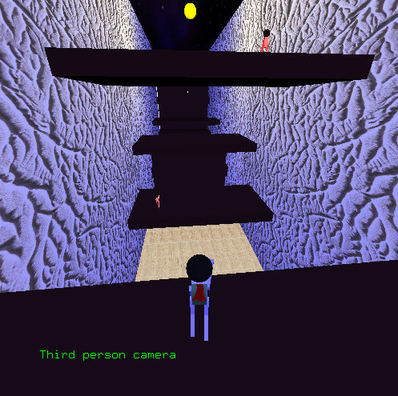
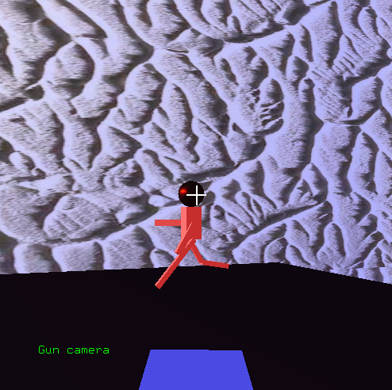
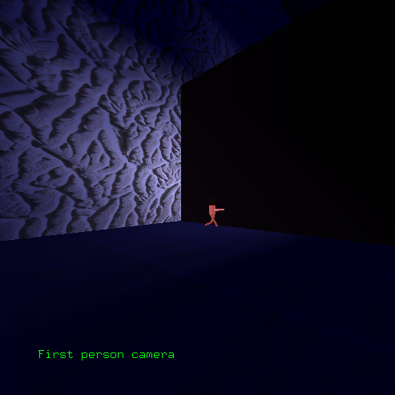

# 3D Game OpenGL

This project is a 3D game developed using **OpenGL**. The arena layout, character movement, and game logic are based on definitions extracted from an SVG file.

<div style="display: flex; justify-content: center; gap: 5px;">
  
  
  
</div>

## 🎮 Description

The game takes place in a **3D hollow arena** represented by a cuboid. The player and opponents are positioned based on an SVG file. The game implements movement, collision detection, and lighting with a **point light** centered at the top of the arena.

### Game Elements

- **Blue rectangle**: arena (playable area)
- **Black rectangles**: obstacles
- **Green circle**: player's starting position
- **Red circles**: opponents' starting positions

## 🔧 Requirements

- C++17 or higher
- OpenGL 3.3+
- GLFW
- GLEW or GLAD
- GLM
- CMake 3.10+

## 🚀 Build Instructions

### Using CMake

```bash
make clean
make all
./trabalhocg
```

Ensure all dependencies are installed on your system.

## 🕹️ Controls

- `W`, `A`, `S`, `D` — Move player
- `Mouse` — Rotate camera

## 💡 Lighting

The arena is illuminated with a **point light** positioned at the center top of the arena. The lighting follows the Phong model, with **ambient**, **diffuse**, and **specular** components.

## 📐 Camera and View

- The window size is **500x500 pixels**.
- Window resizing is **not handled**.

## 🧱 Main Classes

- `Arena` — Loads and represents the environment from SVG
- `Character` — Represents the player
- `Opponent` — Represents enemies
- `Obstacle` — Scene elements that block movement

## 🖼️ SVG Input

The SVG defines:
- Arena dimensions
- Object positions
- Layout of obstacles and characters

The SVG parser converts elements into 3D entities in the game world.

## Authors

- [Caio Fiorotti](https://github.com/fiorotticaio)
- [Matheus Schreiber](https://github.com/matheusschreiber)
